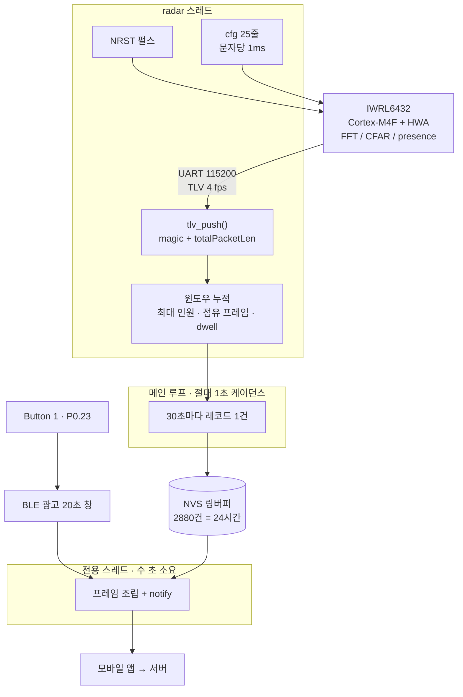

# nRF5340 Presence — 재실 감지 노드

nRF5340 DK (Zephyr / nRF Connect SDK). TI **IWRL6432BOOST** 60 GHz mmWave 레이더를
UART로 물려서 **근로자 수와 체류 시간을 30초마다 플래시에 쌓고**, 버튼을 누르면
**BLE로 모바일 앱에 넘긴다.**

공기질 노드([nRF5340_Wearable](../nRF5340_Wearable))와 같은 저장/전송 구조(SNTL 프레임,
NVS 24시간 링, BLE 덤프)를 쓰되 레코드 내용만 재실 데이터로 바꾼 것이다. 프레임
**version 바이트가 2**라서 앱이 둘을 구분한다.

레이더 브링업 기록과 Python 도구는 원본 저장소에 있다:
[JeonJunYoung-hub/IWRL6432](https://github.com/JeonJunYoung-hub/IWRL6432).

## 하드웨어

**UART 두 선으로는 부족하다.** 데모는 리셋 없이 재설정이 안 되므로 nRF5340이
IWRL6432의 NRST를 직접 잡아야 한다. 양쪽 다 3.3V 로직이라 레벨 시프터는 불필요.

| nRF5340 DK | 방향 | IWRL6432BOOST |
|---|---|---|
네 선 전부 EVM의 **LP/BP 커넥터(J8/J9)** 에서 뽑는다. 납땜 불필요 — SWRU596 Figure 3-5가
`UART`, `RESET`, `SPI`, `I2C`, `SOP0/SOP1` 이 칩에서 LP/BP 커넥터로 나가는 걸 보여준다.

| nRF5340 DK | 방향 | IWRL6432BOOST (J8/J9) |
|---|---|---|
| **P1.00** (Arduino D1) | → | UART **RX** |
| **P1.01** (Arduino D0) | ← | UART **TX** |
| **P1.05** (Arduino D3) | → | **RESET** (NRST, 오픈드레인 active low) |
| GND | — | GND |
| Button 1 (**P0.23**) | — | BLE 광고 20초 창 |

> **S1.4 를 ON 으로 놓을 것.** 점퍼도 저항 제거도 아니고 6핀 DIP 스위치 S1 이다
> (S1.1/S1.2 = SOP0/SOP1, S1.3~S1.6 = 신호 먹싱). SWRU596 Figure 4-1 기준:
> **S1.4 OFF → `XDS_RS232`** (UART가 온보드 XDS110/USB COM 포트로 감),
> **S1.4 ON → `DCA_LP_RS232`** (UART가 DCA1000 헤더 + LP/BP 커넥터로 감).
> ON 으로 바꿔야 XDS110이 라인에서 빠져서 nRF5340의 TX와 안 싸운다.
>
> **J8/J9 핀 번호는 SWRU596에 없다.** BoosterPack 표준이면 J1.3 = RX, J1.4 = TX 인데
> 이 문서로는 확인 불가 — EVM 스키매틱을 보거나 테스터로 도통 확인할 것.
>
> 또 하나 미확인: 데모 CLI/데이터가 `RS232`(볼 F11/E10 = UARTB)인지 `UARTA`(J11/L12)인지.
> **`UARTA` 는 LP/BP 커넥터로 안 나간다** (XDS110 아니면 CAN PHY 뿐). 확인법: S1.4를 ON 으로
> 놓고 지금 쓰던 COM 포트가 죽으면 RS232 쪽이 맞다 — 그러면 그대로 배선하면 된다.
> 안 죽으면 데모가 UARTA를 쓰는 것이고, 그때는 UARTB 핀을 쓰도록 이미지를 다시 굽는 수밖에 없다.

## 데이터 흐름



레이더가 신호처리를 전부 자기 칩에서 끝내고 **결과 TLV만** 보내주기 때문에, nRF5340이
하는 일은 프레이밍·집계·저장뿐이다. 여기엔 실시간 제약이 없다 — 공기질 노드처럼 센서를
1초마다 서비스해야 하는 부담이 없어서 NVS 쓰기를 메인 루프에서 그냥 한다.

### 저장

`src/store.c`. 공기질 노드와 동일하다. NVS 엔트리 하나에 레코드 하나,
ID = `0x100 + (seq % STORE_CAPACITY)` 라서 링버퍼가 공짜로 된다. 별도로 ID 1 에
메타(`next_seq`, `base_sec`)를 같이 쓴다 — **`seq` 는 재부팅을 넘어 이어져야 한다.**

주기는 `src/store.h` 의 `STORE_PERIOD_S` 한 줄, 용량은 거기서 자동 계산돼 항상 24시간치다.
**지금은 테스트용 30초다.** `occ_s` 가 1바이트라 255를 넘기면 안 된다.

### 시간

**이 칩에는 달력 시계가 없다.** 레코드의 `ts` 는 최초 부팅 이후 누적 초이고 모든 레코드에
`RTC_UNSET (0x04)` 플래그가 선다. 받는 쪽이 역산한다:

```
실제시각(레코드) = 다운로드시각 − (현재 ts − 레코드 ts)
```

### BLE

`src/ble.c`. 공기질 노드와 **서비스·UUID·명령이 전부 같다.** 앱 코드를 그대로 쓴다.

| 역할 | UUID | 속성 |
|---|---|---|
| 서비스 | `6e400001-b5a3-f393-e0a9-e50e24dcca9e` | — |
| 제어 (앱→노드) | `6e400002-...` | Write |
| 데이터 (노드→앱) | `6e400003-...` | Notify |

광고는 Button 1 을 눌러야 시작하고 20초 뒤 닫힌다. 덤프 명령은 제어 캐릭터리스틱에
5바이트 `0x01 <uint32 LE firstSeq>`. **알림(CCC) 활성화가 덤프 명령보다 먼저**여야 한다.

기기 ID = 광고 이름 = **`PR` + 팩토리 ID 하위 6 hex** (예: `PRBC5A69`). 공기질 노드의
`SL` 과 달라서 스캔 목록에서 바로 구분된다. 앱이나 서버가 `SL` 로 필터링한다면
`src/ble.h` 의 `BLE_ID_PREFIX` 한 줄을 되돌리면 된다.

### 프레임 포맷 (version 2)

모든 정수 리틀엔디언. 전체 길이 = `16 + 14 × recordCount + 2`. 봉투는 v1과 같고
**레코드 내용만 다르다.**

```
헤더 16B   magic "SNTL" | version 2 | recordSize 14 | recordCount u16 | deviceId 8B
레코드 14B  seq u32 | ts u32 | headcount u8 | occ_s u8 | dwell_s u16 | flags u8 | batt u8
꼬리 2B    crc16
```

| 필드 | 뜻 |
|---|---|
| `headcount` | 그 윈도우에서 **동시에** 잡힌 최대 인원 |
| `occ_s` | 윈도우 중 점유였던 초 (0..`STORE_PERIOD_S`) |
| `dwell_s` | 윈도우가 끝나는 시점의 **끊기지 않은** 재실 시간. 윈도우 경계를 넘어 계속 늘어난다 |

CRC-16/CCITT-FALSE — poly `0x1021`, init `0xFFFF`, 반전 없음, 최종 XOR 없음.
검증 벡터 `"123456789"` → `0x29B1`.

flags: `0x01` SENSOR_FAULT (그 윈도우에 레이더 프레임이 하나도 없었음) · `0x02` LOW_BATTERY ·
`0x04` RTC_UNSET · `0x08` CALIBRATING · **`0x20` NO_TRACKER**

> **`NO_TRACKER` 가 서면 `headcount` 는 인원 수가 아니라 하한선이다.** 트래커가 안 돌 때는
> 디바이스쪽 presence 구역이 "뭔가 움직인다"만 알려주므로 0 아니면 1이 된다.
> **서버가 이 값을 사람 수로 더하면 안 된다.**

## 레이더 링크

`src/radar.c`. PC 브링업에서 걸린 함정이 전부 그대로 적용된다:

1. **CLI와 데이터가 UART 하나를 공유한다.** `sensorStart` 전까지는 텍스트, 이후는 바이너리.
2. **`lowPowerCfg` 는 0이어야 한다.** 1이면 `sensorStart` 이후 UART RX가 죽고 NRST 말고는
   복구 방법이 없다.
3. **리셋 없이는 재설정이 안 된다.** 두 번째 cfg는 모든 줄이 `Done`을 돌려주고도 프레임이
   하나도 안 나온다. 그래서 cfg 전에 항상 NRST를 때린다.
4. **한 줄을 한 번에 쓰면 문자가 유실된다.** 문자당 1ms로 흘려보낸다.
5. **"Error가 없으면 성공"은 틀린 판정.** `Done` 의 존재로만 판정한다.

원본과 다른 점 **세 가지**:

- **`baudRate 1250000` 을 안 보낸다.** Zephyr nrfx UART 드라이버에 1250000 항목이 없고,
  필요하지도 않다 — range profile TLV를 끄면 프레임이 수백 바이트라 4 fps에서 초당 몇 KB,
  115200이 나르는 ~11 KB/s의 몇 %다.
- **`guiMonitor` 의 range profile 끄고 tracker 켬** (`2 0 0 0 0 1 1 0 1 0 0`).
  인자 순서는 `<pointCloud> <rangeProfile> <noiseProfile> <azHeatMap> <dopHeatMap>
  <stats> <presence> <adcSamples> <tracker> <microDoppler> <classifier>`.
- **`trackingCfg 1 2 250 20 0 250` 추가** — 아래 참고.

### 미해결: `trackingCfg`

원본 저장소 노트대로 이 명령은 **거부될 수 있다.** 유력한 가설은 플래시된 이미지가
트래커 DPU가 없는 `Presence_Demo` 라는 것. 인자 개수도 갈린다 — 보드 `help` 는 6개
(`<enable> <paramSet> <numPoints> <numTracks> <maxDoppler> <framePeriod>`)를 표시하는데
SDK 프로파일들은 4개를 쓴다. 이 코드는 **보드 help 쪽 6인자**를 보낸다.

거부돼도 노드는 죽지 않는다:

- `trackingCfg` 만 FAIL 로그가 뜨고 나머지는 계속 진행한다.
- `sensorStart` 까지 실패하면 NRST를 다시 때리고 5초 뒤 전체를 재시도한다.
- 트래커가 안 돌면 `TARGET_LIST` TLV가 안 오고, 그러면 **프레임 단위로** presence TLV로
  떨어져서 레코드에 `NO_TRACKER` 가 선다. 코드 어디에도 "트래커 모드" 상태 변수가 없다.

트래커를 진짜로 켜려면 SDK + CCS로 트래커 포함 이미지를 다시 굽는 수밖에 없고, 그건
**Windows/Linux가 필요하다** (MMWAVE-L-SDK는 맥 인스톨러가 없다).

### 구역

**한 보드 = 한 구역**이다. 보드의 시야 전체가 그 구역이라 별도 좌표 기하가 없다.
트래커가 켜지면 `TARGET_LIST` 의 target 개수가 그대로 인원이 된다. 구역을 쪼개고 싶으면
`on_frame()` 에서 `tgt[i].x / tgt[i].y` 로 사각형 판정을 넣으면 되고, 그건 **호스트쪽
개념**이라 디바이스를 다시 설정할 필요가 없다.

## 빌드

```bash
west build -b nrf5340dk/nrf5340/cpuapp
west flash
```

BLE 컨트롤러는 네트워크 코어에서 돈다. `Kconfig.sysbuild` 가 `ipc_radio` 이미지를 같이
빌드하게 하고, sysbuild 가 두 코어 hex 를 합쳐 굽는다. 리드백 보호로 플래시가 거부되면
`west flash --recover` (두 코어 전부 지워진다).

빌드 결과: FLASH 147844 B / 256 KB (56%), RAM 46488 B / 64 KB (**71%**). RAM이 넉넉하진
않다 — 4 KB UART 링버퍼와 2 KB 프레임 버퍼가 가장 큰 덩어리다.

> **이 PC의 함정:** `C:\ncs\toolchains\dcbdc366a1\opt\bin\python.exe` 의 `ctypes` 가
> 깨져 있어서(`class must define a '_type_' attribute`) 툴체인 번들 `west` 가 아예 안 뜬다.
> nRF Connect VS Code 확장으로 빌드하거나, 별도 venv에 `west` + `pyyaml pyelftools
> packaging jsonschema` 를 깔아 쓰면 된다. 그 venv의 west는 `git` 이 PATH에 있어야
> `west build` 확장 명령을 찾는다.

## 검증

프레임 인코더와 TLV 파서는 보드 없이 호스트에서 돈다. `src/frame.c` 와 `src/tlv.c` 는
Zephyr 의존성이 없는 순수 C 다 — **여기에 Zephyr 헤더를 추가하지 말 것.**

```bash
cd tests
gcc -I../src -o test_frame test_frame.c ../src/frame.c && ./test_frame
gcc -I../src -o test_tlv   test_tlv.c   ../src/tlv.c   && ./test_tlv
```

`test_tlv` 가 보는 것: 바이트 단위 재조립, 연속 프레임, 꼬리에 걸친 부분 magic, 앞쪽
쓰레기 바이트, **거짓 `totalPacketLen` 후 재동기**, 잘린 TLV 길이, GTRACK_3D/2D 자동 판별.
합성 프레임은 원본 저장소 `tools/tlv.py` 의 자체 검증과 같은 값을 쓴다 — 양쪽 디코더가
같은 레이아웃을 본다는 뜻이다.

## 시리얼 확인

nRF5340 DK 는 VCOM 두 개를 만든다. 콘솔은 **두 번째**(예: COM6)다. 115200 8N1.
(레이더는 uart1이라 콘솔과 안 겹친다.)

```
[READY] store: next seq 4, oldest 0, t=241 s
[READY] BLE up as PRBC5A69 - press Button 1 to advertise
[RADAR] ok    sensorStop 0
[RADAR] ok    channelCfg 7 3 0
...
[RADAR] FAIL  trackingCfg 1 2 250 20 0 250
[RADAR] ok    sensorStart 0 0 0 0
[START] radar streaming
[   371s] frame 1481  targets 2  #9(150,300cm)  #12(-80,420cm)
[STORE] 390s  headcount 2  occupied 24s/30s  dwell 51s
```

## IWRL6432 로 할 수 있는 것

칩 자체는 57–63.9 GHz FMCW 레이더 SoC다. Cortex-M4F + 하드웨어 가속기(HWA)가 들어 있고
**레이더 신호처리가 전부 칩 안에서 끝난다.** 호스트는 결과만 받는다. 그래서 "뭘 할 수
있나"는 **어떤 데모 이미지를 플래시했느냐**로 거의 정해진다.

TI가 제공하는 데모 기준:

| 기능 | 나오는 값 | 지금 이 보드 |
|---|---|---|
| **Presence / motion detection** | 구역별 2bit 상태 (none/minor/major) | ✅ 동작 확인 |
| **Zone detection** | `mpdBoundaryBox` 로 나눈 구역별 재실 | ✅ (지금 1구역) |
| **Point cloud** | 검출점 x/y/z, doppler, SNR | ✅ 동작 확인 |
| **People counting / tracking** | target별 `tid` + 좌표 + 속도 → 인원 수, 1인 단위 체류 | ⚠️ `trackingCfg` 거부 — 이미지 재플래시 필요 |
| **Classifier (micro-Doppler)** | 사람 / 비사람 구분 | ❌ 별도 이미지 |
| **Vital signs** | 호흡수 (심박까지) | ❌ 별도 이미지 |
| **Gesture recognition** | 손동작 인식 | ❌ 별도 이미지 |
| **Level sensing** | 액체/고체 레벨 | ❌ 별도 이미지 |

이 프로젝트가 목표로 하는 **근로자 수 + 체류 시간**은 트래커가 있어야 한다.
`ENHANCED_PRESENCE` (TLV 315)는 구역당 2비트 상태일 뿐 사람 수가 아니고, 체류 시간도
프레임 간 유지되는 식별자가 없으면 "구역이 몇 초 점유됐다"까지밖에 안 된다. 그래서
`headcount` 가 `NO_TRACKER` 없이 나오려면 트래커 포함 이미지가 필요하다.

**꼭 알아야 할 한계 하나:** presence 데모는 사람이 아니라 **움직임**을 본다. 선풍기,
여닫히는 문, 진동하는 기계가 시야에 있으면 근로자와 똑같이 읽힌다. 이걸 가르는 건
micro-Doppler classifier인데 그것도 별도 이미지다.

현재 프로파일의 감지 거리는 `rangeSelCfg 0.25 7.5` → **0.25 ~ 7.5 m**, 시야각은
`aoaFovCfg -70 70 -60 60` → 방위 ±70°, 고도 ±60°.

## 관련 저장소

- [JeonJunYoung-hub/IWRL6432](https://github.com/JeonJunYoung-hub/IWRL6432) — 레이더
  브링업 기록과 Python 도구(`radar.py` / `tlv.py` / `monitor.py`). **먼저 읽을 것.**
- [JeonJunYoung-hub/nRF5340_Wearable](https://github.com/JeonJunYoung-hub/nRF5340_Wearable) —
  공기질(PM2.5/PM10) 노드. 저장/BLE 코드의 원본.
