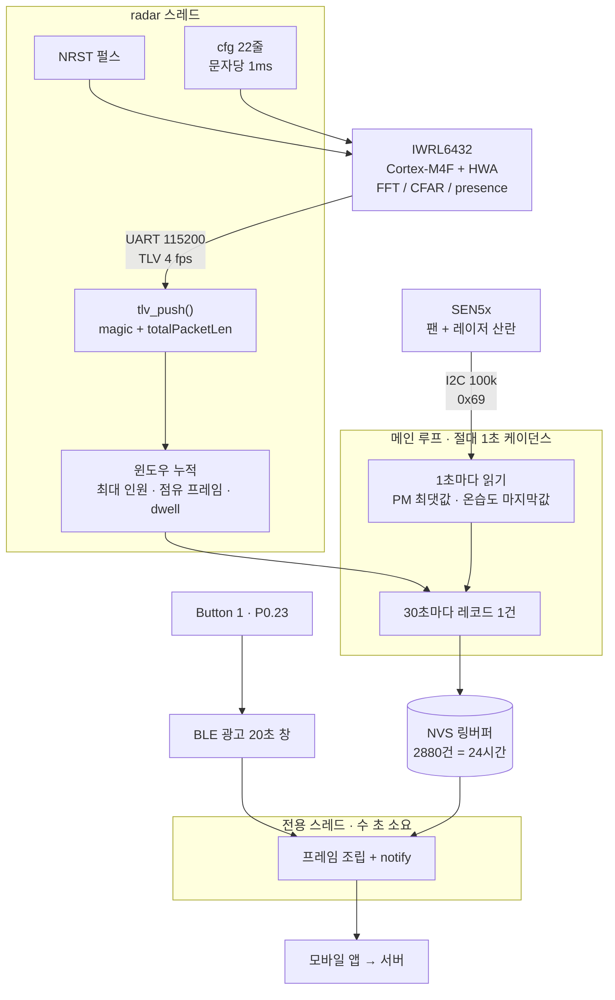

# nRF5340 Presence — 재실 + 공기질 노드

nRF5340 DK (Zephyr / nRF Connect SDK). TI **IWRL6432BOOST** 60 GHz mmWave 레이더를
UART로, Sensirion **SEN5x** 미세먼지 센서를 I2C로 물려서 **재실·체류 시간과 PM2.5/PM10을
30초마다 플래시에 쌓고**, 버튼을 누르면 **BLE로 모바일 앱에 넘긴다.**

공기질 노드([nRF5340_Wearable](../nRF5340_Wearable))와 같은 저장/전송 구조(SNTL 프레임,
NVS 24시간 링, BLE 덤프)를 쓴다. 프레임 **version 바이트가 3**이고 (v1 = 공기질 전용,
v2 = 재실 전용), 레코드는 **v2의 14바이트를 그대로 두고 뒤에 10바이트를 붙인 형태**라
v2를 읽던 코드는 오프셋을 하나도 안 바꿔도 된다.

두 센서는 서로 독립적으로 죽는다. 레이더가 죽으면 `SENSOR_FAULT`, SEN5x가 죽으면
`AQ_FAULT`가 붙고, 한쪽 고장이 다른 쪽 값을 막지 않는다.

레이더 브링업 기록과 Python 도구는 원본 저장소에 있다:
[JeonJunYoung-hub/IWRL6432](https://github.com/JeonJunYoung-hub/IWRL6432).

## 하드웨어

**UART 두 선으로는 부족하다.** 데모는 리셋 없이 재설정이 안 되므로 nRF5340이
IWRL6432의 NRST를 직접 잡아야 한다. 양쪽 다 3.3V 로직이라 레벨 시프터는 불필요.
전원선은 필요 없다 — 두 보드가 각자 USB로 먹고 GND만 공유한다.

세 선 전부 EVM의 **LP/BP 커넥터(J8/J9)** 에서 뽑는다. 납땜 불필요.
핀 번호는 EVM 스키매틱 [SWRR180](https://www.ti.com/lit/zip/SWRR180) sheet 15 기준이며
실물에서 통신까지 확인했다.

| nRF5340 DK | 방향 | IWRL6432BOOST |
|---|---|---|
| **P1.04** (실크 **D2**) | → | **J8 7번** — `DCA_LP_RS232_RX`, 레이더 입력 |
| **P1.05** (실크 **D3**) | ← | **J8 5번** — `DCA_LP_RS232_TX`, 레이더 출력 |
| **P1.06** (실크 **D4**) | → | **J9 10번** — `RADAR_NRST_2`, 오픈드레인 active low |
| GND | — | **J8 4번** 또는 **J9 2번** |
| Button 1 (**P0.23**) | — | BLE 광고 20초 창 |
| Button 2 | — | 부팅 시 누르고 있으면 핀 프로브 모드 |

Arduino 실크와 포트 번호는 서로 어긋난다 (D0=P1.00, D1=P1.01, **D2=P1.04**, D3=P1.05,
D4=P1.06). 숫자만 보고 P1.04를 D4에 꽂으면 NRST 자리에 TX가 간다.

### SEN5x (미세먼지)

커넥터는 ACES 51451-0060N-001, 짝은 JST GHR-06V-S로도 된다. 6핀 중 1번이 공기 배출구 쪽.

| SEN5x | | nRF5340 DK |
|---|---|---|
| 1 VDD | ← | **5V** (전원 헤더) |
| 2 GND | — | GND |
| 3 SDA | ↔ | **P1.02** (실크 **SDA**) |
| 4 SCL | ← | **P1.03** (실크 **SCL**) |
| 5 SEL | — | **GND** |
| 6 NC | | 연결 안 함 |

주의할 것 세 가지:

- **VDD는 5V다.** 3V3에 꽂으면 팬과 레이저가 안 돈다. 데이터시트 5V ±10%, DK의 5V 핀은
  USB에서 바로 온다.
- **SEL은 전원이 들어오기 전 또는 동시에 GND여야 I2C가 선택된다.** 나중에 꽂으면 안 잡힌다.
  선으로 GND에 묶어두면 된다.
- **금속 케이스는 띄워둔다.** 내부에서 2번 핀(GND)과 연결돼 있어서, 케이스에 별도 접지를
  주면 그 경로로 전류가 흐른다 (데이터시트 4장).

로직은 3.3V 호환이라 레벨 시프터는 필요 없다. 풀업은 데이터시트가 외부 10k를 권하지만
지금은 nRF 내장 풀업(~13k)을 쓴다 — 짧은 점퍼선에서는 붙고, 긴 배선이면 10k를 달아라.

**I2C는 i2c1이 아니라 i2c2다.** nRF5340에서 uart1과 i2c1은 같은 SERIAL1 인스턴스라
레이더와 충돌한다. 핀은 DK가 SDA/SCL이라 찍어놓은 그 자리(P1.02/P1.03) 그대로 쓰고
뒤에 붙는 페리페럴만 i2c2로 바꿨다.

### 스위치

6핀 DIP가 **S1**, 4핀 DIP는 S4(CAN/LIN용, 무관)다.

| | 값 | 이유 |
|---|---|---|
| **S1.1** (SOP0) | **ON** | Functional 모드. OFF면 Flashing 모드라 데모가 아예 안 돈다 |
| S1.2 (SOP1) | OFF | |
| **S1.4** | **ON** | `DCA_LP_RS232` 로 먹싱 → UART가 J8로 나간다. OFF면 온보드 XDS110(USB COM)으로 가고 그쪽이 우리 TX와 싸운다 |
| S1.5 / S1.6 | ON | |

스위치를 바꾼 뒤에는 NRST를 한 번 줘야 SOP 설정이 반영된다.

> **확인됨:** 데모 CLI와 TLV는 둘 다 `RS232`(볼 E10/F11 = UARTB)로 나간다.
> S1.4를 ON 하면 XDS110 COM 포트가 죽고, OFF 하면 `mmwDemo:/>` 가 돌아온다.
> `UARTA`(J11/L12)는 데모가 쓰지 않고, J9 13번(UARTA_RX)은 **R147 미실장**이라
> 애초에 배선도 안 되어 있다.

### J8 구멍 찾기

여기서 제일 많이 헤맨다. **J8/J9는 기판 뒷면에 있어서 보드를 뒤집으면 좌우가 뒤집힌다.**
도면과 실물을 방향으로 맞추려 들면 계속 어긋난다. 대신 측정으로 기준을 잡는다.

오버레이의 RX 핀 bias를 `bias-pull-down` 으로 바꾸고 Button 2 프로브 모드로 구멍을
훑으면, **능동 구동되는 핀만 HIGH** 로 읽힌다. J8에서 그런 핀은 딱 둘이다 —
**5번**(레이더 TX)과 **14번**(PGOOD). 한 열에서 HIGH가 하나만 나오면 그게 14번이고,
그 한 점에서 열·방향·1번 끝이 전부 역산된다 (14번은 자기 열에서 한쪽 6개 / 반대쪽 3개).

| J8 핀 | 신호 |
|---|---|
| 1 | MCU_3V3 (R132 미실장 → 뜬 핀) |
| **2** | **MCU_5V** — GND 아님. 여기 접지하면 공통 기준이 없어져 `rx=0` 이 된다 |
| **4** | **GND** — J8의 유일한 접지 |
| **5 / 7** | RS232 TX / RX (R35 / R36) |
| 14 | PGOOD |
| 17 / 19 | I2C SCL / SDA |
| 3, 6, 8, 9, 10, 11, 12, 16, 18, 20 | NC 또는 미실장 |

## 데이터 흐름



레이더가 신호처리를 전부 자기 칩에서 끝내고 **결과 TLV만** 보내주기 때문에, nRF5340이
하는 일은 프레이밍·집계·저장뿐이다. 여기엔 실시간 제약이 없다 — 공기질 노드처럼 센서를
1초마다 서비스해야 하는 부담이 없어서 NVS 쓰기를 메인 루프에서 그냥 한다.

### 저장

`src/store.c`. 공기질 노드와 동일하다. NVS 엔트리 하나에 레코드 하나,
ID = `0x100 + (seq % STORE_CAPACITY)` 라서 링버퍼가 공짜로 된다. 별도로 ID 1 에
메타(`next_seq`, `base_sec`)를 같이 쓴다 — **`seq` 는 재부팅을 넘어 이어져야 한다.**

주기는 `src/store.h` 의 `STORE_PERIOD_S` 한 줄, 용량은 거기서 자동 계산돼 항상 24시간치다.
**지금은 테스트용 30초다.** `occ_s` 가 1바이트라 255를 넘기면 안 된다.

레코드가 24바이트로 커지면서 30초 주기 기준 하루치가 **2880 × 32B ≈ 90KB** (160KB 파티션)
가 됐다. 60초로 돌리면 45KB. 더 짧게 할 거면 이 계산부터 다시 해라.

**포맷이 바뀌면 기존 레코드는 지운다.** `nvs_read()` 는 `sizeof(struct sntl_record)` 를
정확히 요구해서 옛 16바이트 엔트리는 읽히지도 않고, 다시 쓰이지도 않으니 NVS가 회수도
못 한다. 그래서 ID 2에 레코드 크기를 적어두고 다를 때 `nvs_clear()` 한다. **`seq` 는
살린다** — 서버가 `(device_id, seq)` 로 중복을 거르므로 0부터 다시 세면 새 데이터가
옛 데이터와 충돌해서 버려진다. 대신 ID 3에 "여기 아래는 없다" 하한선을 적어서, 방금
지운 구간을 앱이 요청하는 일이 없게 했다.

### 시간

**이 칩에는 달력 시계가 없다.** 레코드의 `ts` 는 최초 부팅 이후 누적 초이고 모든 레코드에
`RTC_UNSET (0x04)` 플래그가 선다. 받는 쪽이 역산한다:

```
실제시각(레코드) = 다운로드시각 − (최신 ts − 레코드 ts)
```

**이 역산은 앱이 한다** (`sentinel_app/lib/data/packet.dart`, `SentinelPacket.parse`).
프레임에서 가장 최신 레코드가 방금 찍힌 것이므로 그것을 다운로드 시각에 맞추고
나머지를 같은 간격만큼 뒤로 민다. 안 하면 모든 레코드가 1970년으로 들어가서
서버의 '오늘' 집계가 통째로 비어버린다 — 실제로 그렇게 한 번 나왔다.

정확한 건 레코드 사이의 간격이지 절대 시각이 아니다. 전원이 완전히 꺼져 있던
구간은 그 공백을 알 방법이 없어서 그만큼 어긋나고, 그래서 앱이 `ts_derived`
품질 태그를 붙여 파생값임을 남긴다.

### BLE

`src/ble.c`. 공기질 노드와 **서비스·UUID·명령이 전부 같다.** 앱 코드를 그대로 쓴다.

| 역할 | UUID | 속성 |
|---|---|---|
| 서비스 | `6e400001-b5a3-f393-e0a9-e50e24dcca9e` | — |
| 제어 (앱→노드) | `6e400002-...` | Write |
| 데이터 (노드→앱) | `6e400003-...` | Notify |

광고는 Button 1 을 눌러야 시작하고 20초 뒤 닫힌다. 덤프 명령은 제어 캐릭터리스틱에
5바이트 `0x01 <uint32 LE firstSeq>`. **알림(CCC) 활성화가 덤프 명령보다 먼저**여야 한다.

기기 ID = 광고 이름 = **`PR` + 팩토리 ID 하위 6 hex** (예: `PRBC5A69`). 공기질 노드의
`SL` 과 달라서 스캔 목록에서 바로 구분된다. 앱이나 서버가 `SL` 로 필터링한다면
`src/ble.h` 의 `BLE_ID_PREFIX` 한 줄을 되돌리면 된다.

### 프레임 포맷 (version 3)

모든 정수 리틀엔디언. 전체 길이 = `16 + 24 × recordCount + 2`. 봉투는 v1·v2와 같다.

```
헤더 16B   magic "SNTL" | version 3 | recordSize 24 | recordCount u16 | deviceId 8B
레코드 24B  [v2와 동일한 앞 14B]
            seq u32 | ts u32 | headcount u8 | occ_s u8 | dwell_s u16 | flags u8 | batt u8
           [v3에서 추가된 뒤 10B]
            pm25 u16 | pm10 u16 | temp i16 | rh i16 | voc i16
꼬리 2B    crc16
```

| 필드 | 뜻 |
|---|---|
| `headcount` | 그 윈도우에서 **동시에** 잡힌 최대 인원 |
| `occ_s` | 윈도우 중 점유였던 초 (0..`STORE_PERIOD_S`) |
| `dwell_s` | 윈도우가 끝나는 시점의 **끊기지 않은** 재실 시간. 윈도우 경계를 넘어 계속 늘어난다 |
| `pm25`, `pm10` | 0.1 µg/m³ 단위. 윈도우 안 **최댓값** |
| `temp` | 0.01 °C |
| `rh` | 0.01 %RH |
| `voc` | 0.1 VOC 지수 (SEN54/SEN55만) |

**PM만 최댓값이고 나머지는 마지막 값이다.** 30초 창 안에서 10초짜리 분진 이벤트가
일어나는 게 이 제품이 잡아야 할 바로 그 상황이라, 평균을 내면 그게 지워진다. 온습도는
그만큼 빨리 안 변해서 마지막 샘플이 창 전체를 대표한다.

**"측정 안 됨"** — SEN50은 온습도·가스 센서가 아예 없고 SEN54는 NOx가 없다. 없는 값은
센서가 `0xFFFF`로 답하고 그대로 흘려보낸다. 부호 있는 필드(`temp`/`rh`/`voc`)만
`0x7FFF`를 쓴다 — `0xFFFF`는 거기서 `-1`이고 −0.01 °C는 충분히 있을 법한 값이라서다.

플래그 `0x40 AQ_FAULT` = 이번 창에 SEN5x 응답이 없었거나, 응답했지만 상태 레지스터가
팬/레이저 고장을 알렸다는 뜻. **이때도 PM 값은 그대로 보낸다** — 버리지 않고 표시만 한다.
팬이 멈추면 PM이 낮게 읽히고 그건 "공기 깨끗함"으로 보이기 때문에, 레이더 쪽
`SENSOR_FAULT`와 비트를 공유하지 않는다.

CRC-16/CCITT-FALSE — poly `0x1021`, init `0xFFFF`, 반전 없음, 최종 XOR 없음.
검증 벡터 `"123456789"` → `0x29B1`.

flags: `0x01` SENSOR_FAULT (그 윈도우에 레이더 프레임이 하나도 없었음) · `0x02` LOW_BATTERY ·
`0x04` RTC_UNSET · `0x08` CALIBRATING · **`0x20` NO_TRACKER**

> **`NO_TRACKER` 가 서면 `headcount` 는 인원 수가 아니라 하한선이다.** 트래커가 안 돌 때는
> 디바이스쪽 presence 구역이 "뭔가 움직인다"만 알려주므로 0 아니면 1이 된다.
> **서버가 이 값을 사람 수로 더하면 안 된다.**

## 레이더 링크

`src/radar.c`. PC 브링업에서 걸린 함정이 전부 그대로 적용된다:

1. **CLI와 데이터가 UART 하나를 공유한다.** `sensorStart` 전까지는 텍스트, 이후는 바이너리.
2. **`lowPowerCfg` 는 0이어야 한다.** 1이면 `sensorStart` 이후 UART RX가 죽고 NRST 말고는
   복구 방법이 없다.
3. **리셋 없이는 재설정이 안 된다.** 두 번째 cfg는 모든 줄이 `Done`을 돌려주고도 프레임이
   하나도 안 나온다. 그래서 cfg 전에 항상 NRST를 때린다.
4. **한 줄을 한 번에 쓰면 문자가 유실된다.** 문자당 1ms로 흘려보낸다.
5. **"Error가 없으면 성공"은 틀린 판정.** `Done` 의 존재로만 판정한다.

원본과 다른 점 **세 가지**:

- **`baudRate 1250000` 을 안 보낸다.** Zephyr nrfx UART 드라이버에 1250000 항목이 없고,
  필요하지도 않다 — range profile TLV를 끄면 프레임이 수백 바이트라 4 fps에서 초당 몇 KB,
  115200이 나르는 ~11 KB/s의 몇 %다.
- **`guiMonitor` 는 인자 12개** (`2 0 0 0 0 1 1 0 1 0 0 0`). range profile 끄고 tracker 켬.
  순서는 `<pointCloud> <rangeProfile> <noiseProfile> <rangeAzimuthHeatMap>
  <rangeDopplerHeatMap> <statsInfo> <presenceInfo> <adcSamples> <trackerInfo>
  <microDopplerInfo> <classifierInfo> <quickEvalInfo>`. 공개 문서(05.05.04)는 11개로
  적어놨고 CLI는 11개에도 `Done` 을 돌려주기 때문에 틀려도 티가 안 난다.
- **`sigProcChainCfg` 의 `motDetMode` 는 3**. `1`=major만, `2`=minor만, `3`=둘 다.
  원래 `2`였는데 그러면 major motion 포인트 클라우드가 안 생긴다.
- **`trackingCfg` 는 인자 7개** — 아래 참고.

### 트래커: 켜면 데모가 죽는다 (실측)

이 EVM 이미지(**xWRL6432 MMW Demo 05.05.03.00**)에서 트래커 할당 경로를 켜면
**major motion 포인트가 처음 나오는 순간 데모가 송신을 멈춘다.** NRST 말고는 안 돌아온다.

재현: `boundaryBox` / `staticBoundaryBox` 를 보내면 `sensorStart` 까지 정상 통과하고
스트리밍도 되다가, `pts` 가 0에서 처음 올라가는 프레임을 마지막으로 UART 바이트
카운터가 그 자리에서 얼어붙는다. 2회 모두 `pts 2` 에서 발생. 재조립기는 깨끗해서
(`len=0 want=0 match=0`) 호스트 파싱 문제가 아니다. 두 명령을 빼면 같은 빌드가
포인트 15개짜리 클라우드도 문제없이 흘린다.

그래서 **두 명령을 의도적으로 안 보낸다.** `trackingCfg` 자체는 보내고 통과하지만,
boundaryBox가 없으면 GTRACK이 트랙을 할당하지 않으므로 `TARGET_LIST` 는 오지 않는다.
결과적으로 레코드에는 항상 `NO_TRACKER` 가 서고 `headcount` 는 0/1 하한선이다.
재실 여부·점유 시간·체류 시간은 정확하다. **인원 수만 못 센다.**

`trackingCfg` 인자 개수도 함정이다. 보드 `help` 는 6개
(`<enable> <paramSet> <numPoints> <numTracks> <maxDoppler> <framePeriod>`)로 표시하는데
그 6개를 그대로 보내면 `Error` 가 난다. 파서는 7개를 요구한다 —
`<enable> <initialConfigParams> <maxNumPoints> <maxNumTracks> <maxRadialVelocity>
<radialVelocityResolution> <deltaT>`. **`help` 는 축약본이지 스펙이 아니다.**

진짜로 인원을 세려면 트래커가 살아있는 이미지로 EVM을 다시 구워야 한다
(Radar Toolbox의 Motion+Presence 데모, UniFlash, SOP를 Flashing 모드로).

### 스톨 자동 복구

위 크래시 말고도 데모가 조용히 멈추는 경우가 있어서, **10초간 프레임이 없으면**
NRST를 때리고 cfg 전체를 다시 밀어넣는다 (`RADAR_STALL_MS`). 이게 없을 때 벤치에서
14분 동안 빈 레코드만 쌓인 적이 있다. 복구 로그에 바이트 카운터가 같이 찍히므로
레이더가 멈춘 건지 우리가 프레이밍을 잃은 건지 구분된다.

### 구역

**한 보드 = 한 구역**이다. 보드의 시야 전체가 그 구역이라 별도 좌표 기하가 없다.
트래커가 켜지면 `TARGET_LIST` 의 target 개수가 그대로 인원이 된다. 구역을 쪼개고 싶으면
`on_frame()` 에서 `tgt[i].x / tgt[i].y` 로 사각형 판정을 넣으면 되고, 그건 **호스트쪽
개념**이라 디바이스를 다시 설정할 필요가 없다.

## 빌드

```bash
west build -b nrf5340dk/nrf5340/cpuapp
west flash
```

BLE 컨트롤러는 네트워크 코어에서 돈다. `Kconfig.sysbuild` 가 `ipc_radio` 이미지를 같이
빌드하게 하고, sysbuild 가 두 코어 hex 를 합쳐 굽는다. 리드백 보호로 플래시가 거부되면
`west flash --recover` (두 코어 전부 지워진다).

빌드 결과: FLASH 147844 B / 256 KB (56%), RAM 46488 B / 64 KB (**71%**). RAM이 넉넉하진
않다 — 4 KB UART 링버퍼와 2 KB 프레임 버퍼가 가장 큰 덩어리다.

> **이 PC의 함정:** `C:\ncs\toolchains\dcbdc366a1\opt\bin\python.exe` 의 `ctypes` 가
> 깨져 있어서(`class must define a '_type_' attribute`) 툴체인 번들 `west` 가 아예 안 뜬다.
> nRF Connect VS Code 확장으로 빌드하거나, 별도 venv에 `west` + `pyyaml pyelftools
> packaging jsonschema` 를 깔아 쓰면 된다. 그 venv의 west는 `git` 이 PATH에 있어야
> `west build` 확장 명령을 찾는다.

## 검증

프레임 인코더와 TLV 파서는 보드 없이 호스트에서 돈다. `src/frame.c` 와 `src/tlv.c` 는
Zephyr 의존성이 없는 순수 C 다 — **여기에 Zephyr 헤더를 추가하지 말 것.**

```bash
cd tests
gcc -I../src -o test_frame test_frame.c ../src/frame.c && ./test_frame
gcc -I../src -o test_tlv   test_tlv.c   ../src/tlv.c   && ./test_tlv
```

`test_tlv` 가 보는 것: 바이트 단위 재조립, 연속 프레임, 꼬리에 걸친 부분 magic, 앞쪽
쓰레기 바이트, **거짓 `totalPacketLen` 후 재동기**, 잘린 TLV 길이, GTRACK_3D/2D 자동 판별.
합성 프레임은 원본 저장소 `tools/tlv.py` 의 자체 검증과 같은 값을 쓴다 — 양쪽 디코더가
같은 레이아웃을 본다는 뜻이다.

`test_frame` 은 v3 레코드 24바이트를 바이트 오프셋까지 확인하고, 영하 온도가 2의 보수로
살아 넘어가는지와 `0x7FFF` 센티널과 안 겹치는지도 본다.

앱 쪽 짝은 `sentinel_app/test/packet_test.dart` 다 (`flutter test`). 인코드→파스 왕복,
"측정 안 됨"이 0 이 아니라 null 로 오는지, 영하 온도를 같이 본다. **펌웨어의
`src/frame.h` 와 앱의 `lib/data/packet.dart` 는 같이 고쳐야 한다.**

### 아직 실물 검증 안 된 것

**SEN5x 는 코드만 있고 실물에서 안 돌려봤다.** 레이더 쪽(링크·cfg·TLV·NVS·BLE 덤프·
스톨 복구)은 전부 실측이 끝났지만, 미세먼지 센서는 배선 후 아래를 확인해야 한다:

1. 부팅 로그에 `[SEN5x] SEN55` (또는 SEN50/SEN54) — 여기까지 나오면 I2C 배선이 맞다
2. `[READY] SEN5x measuring`
3. 30초 뒤 `[STORE] ... pm2.5 12.3  pm10 45.6  23.50 C  45%RH`
4. `dl.py` 로 받은 값이 3번 콘솔 값과 일치 — 어긋나면 바이트 오프셋이 틀린 것이다

센서를 안 꽂아도 부팅은 된다. `[ERROR] SEN5x start failed` 가 뜨고 모든 레코드에
`AQ_FAULT` 가 붙는다.

## 시리얼 확인

nRF5340 DK 는 VCOM 두 개를 만든다. 콘솔은 **두 번째**(예: COM6)다. 115200 8N1.
(레이더는 uart1이라 콘솔과 안 겹친다.)

```
[READY] store: next seq 4, oldest 0, t=241 s
[READY] BLE up as PRBC5A69 - press Button 1 to advertise
[RADAR] ok    sensorStop 0
[RADAR] ok    channelCfg 7 3 0
...
[RADAR] FAIL  trackingCfg 1 2 250 20 0 250
[RADAR] ok    sensorStart 0 0 0 0
[START] radar streaming
[   371s] frame 1481  targets 2  #9(150,300cm)  #12(-80,420cm)
[STORE] 390s  headcount 2  occupied 24s/30s  dwell 51s
```

## IWRL6432 로 할 수 있는 것

칩 자체는 57–63.9 GHz FMCW 레이더 SoC다. Cortex-M4F + 하드웨어 가속기(HWA)가 들어 있고
**레이더 신호처리가 전부 칩 안에서 끝난다.** 호스트는 결과만 받는다. 그래서 "뭘 할 수
있나"는 **어떤 데모 이미지를 플래시했느냐**로 거의 정해진다.

TI가 제공하는 데모 기준:

| 기능 | 나오는 값 | 지금 이 보드 |
|---|---|---|
| **Presence / motion detection** | 구역별 2bit 상태 (none/minor/major) | ✅ 동작 확인 |
| **Zone detection** | `mpdBoundaryBox` 로 나눈 구역별 재실 | ✅ (지금 1구역) |
| **Point cloud** | 검출점 x/y/z, doppler, SNR | ✅ 동작 확인 |
| **People counting / tracking** | target별 `tid` + 좌표 + 속도 → 인원 수, 1인 단위 체류 | ❌ 켜면 데모가 죽는다 — 이미지 재플래시 필요 |
| **Classifier (micro-Doppler)** | 사람 / 비사람 구분 | ❌ 별도 이미지 |
| **Vital signs** | 호흡수 (심박까지) | ❌ 별도 이미지 |
| **Gesture recognition** | 손동작 인식 | ❌ 별도 이미지 |
| **Level sensing** | 액체/고체 레벨 | ❌ 별도 이미지 |

이 프로젝트가 목표로 하는 **근로자 수 + 체류 시간**은 트래커가 있어야 한다.
`ENHANCED_PRESENCE` (TLV 315)는 구역당 2비트 상태일 뿐 사람 수가 아니고, 체류 시간도
프레임 간 유지되는 식별자가 없으면 "구역이 몇 초 점유됐다"까지밖에 안 된다. 그래서
`headcount` 가 `NO_TRACKER` 없이 나오려면 트래커 포함 이미지가 필요하다.

**꼭 알아야 할 한계 하나:** presence 데모는 사람이 아니라 **움직임**을 본다. 선풍기,
여닫히는 문, 진동하는 기계가 시야에 있으면 근로자와 똑같이 읽힌다. 이걸 가르는 건
micro-Doppler classifier인데 그것도 별도 이미지다.

현재 프로파일의 감지 거리는 `rangeSelCfg 0.25 7.5` → **0.25 ~ 7.5 m**, 시야각은
`aoaFovCfg -70 70 -60 60` → 방위 ±70°, 고도 ±60°.

## 관련 저장소

- [JeonJunYoung-hub/IWRL6432](https://github.com/JeonJunYoung-hub/IWRL6432) — 레이더
  브링업 기록과 Python 도구(`radar.py` / `tlv.py` / `monitor.py`). **먼저 읽을 것.**
- [JeonJunYoung-hub/nRF5340_Wearable](https://github.com/JeonJunYoung-hub/nRF5340_Wearable) —
  공기질(PM2.5/PM10) 노드. 저장/BLE 코드의 원본.
